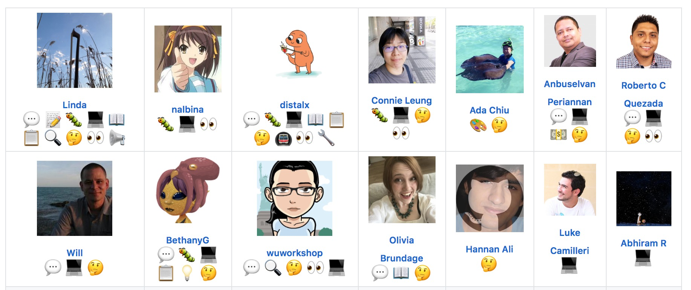

# 8/ Recognition as a Contributor

## Recognition as a contributor

Submitted your PR? Congratulations! There are two places you should add yourself as a contributor: README.md, and the [codebuddies.org/about](http://codebuddies.org/about) page.

First:

* Create a new branch called `add-contributor-[YOUR USERNAME]` branch.
  * `git checkout -b add-contributor-username`

## README.md

* At the bottom of our README.md, we display a table of everyone who've contributed to the project using this npm package: [https://www.npmjs.com/package/all-contributors-cli](https://www.npmjs.com/package/all-contributors-cli).



* To add your **own** profile to the table, you'll need to type in the terminal
* * `npm run contributors:add --GITHUB_USERNAME`
* For example:


  
You'll see a prompt to confirm your Github username and select all the contribution types you've made.


  
When you are done, you'll notice that changes have been automatically made to the README.md. You can commit.

## [ABOUT](http://codebuddies.org/about) page

* Open `imports/data/contributors.json` in your editor of choice
* Add your details:

```markup
 {
      "title": "@username",
      "socials": {
        "twitter": "http://twitter.com/username",
        "github": "http://github.com/username",
        "blog": "http://username.github.io"
      },
      "location": "London, England",
      "contribution":
        "Reviewed pull requests and contributed features to CodeBuddies' Greetbot slack bot.",
      "avatar": "https://avatars2.githubusercontent.com/u/8461452?s=460&v=4",
      "name": "FirstName LastName",
      "type": "code"
    },
```

* Make sure you grab your avatar URL image by copying and pasting the link of your avatar image on your Github profile page. The URL should look something like 

  ```markup
  https://avatars2.githubusercontent.com/u/8461452?s=460&v=4
  ```

  For example:


* Finally, depending on what you contributed, the "type" \(last key\) can be one of: 
  * `slack (actively helped others on Slack)`  
  * `code (submitted PRs)`
  * `sponsors (helped sponsor or find sponsors for opencollective.com/codebuddies)`
  * `welcome (helped actively welcome and brainstorm the user journey for new members in #introduce-yourself)`
  * `other`
* Commit and push your changes!

## Submit a PR

* [Submit a PR](https://help.github.com/articles/creating-a-pull-request/)! \(You may link it to your issues' PR, so the code reviewer can review your contributor additions as well.\)
* **Remember not to delete this branch, so that others can use the** `adding-contributor` **as well**

