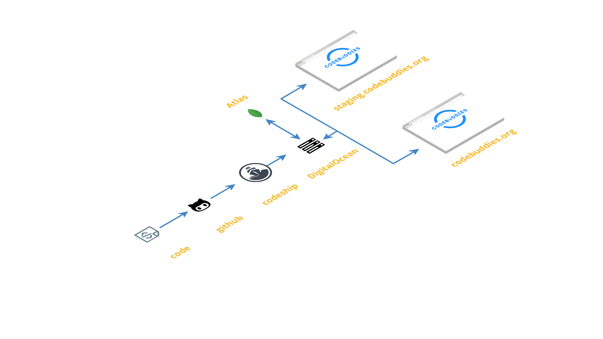

# Deployment

Our deployment recipe contains the following ingredients:

* DigitalOcean droplet
* PhusionPassenger \(app-server\)
* Nginx \(webserver\)
* Codeship \(Shipping\)
* Let's Encrypt for SSL
* MongoDB Atlas
* Github \(source code\)

This is our code shipping workflow: Github -&gt; Codeship -&gt; DigitalOcean

We have a Codeship hook attached to our Github repo, and Codeship has write access to our droplet.

When someone creates a PR or pushes any code, it'll be tested against the staging branch. \(We do have pipelines but we don't have any tests. It is a work in progress.\)

Once we merge that branch to staging, the code is deployed by Codeship, triggering the initiate.sh script located in the .deploy directory in our droplet.

After a couple of PR merges to staging, we'll decide to push out a release. To push out the release, we'll merge the staging branch into the master branch and Codeship will again trigger the initiate.sh script which will deploy the new build to the DO droplet.

On the DO droplet, we have two apps running: cb-stage and cb-prod. Codeship generates new bundlers for each release and will swap them with the old one.

At this point we do have a two-pipeline setup: one on master and one on the staging branch. I think that's sufficient enough for our use case.

Also, Codeship notifications have been added to our Slack; you can see build statuses for each PR in the \#codebuddies-ops channel.

Note: Right now only a few core contributors on the dev team have access to Codeship's dashboard. If you want to take a look at it, please let us know about your interest on Slack.

_Contributors:_ @distalx, @linda

