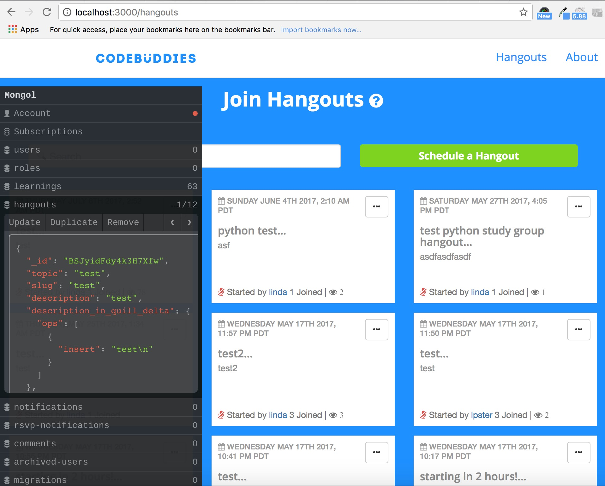

# Development Tips & Tricks

## 1. `ag`, the Silver Searcher

[Install the silver searcher](https://github.com/ggreer/the_silver_searcher) \(`ag`\). This will make your life so much easier when you need to search through files for keywords.

Example commands that you can type in your terminal, once you have `ag` installed:

```text
$ ag "keyword" -C10
//Returns all the files containing the keyword "keyword" along with the 10 lines before and after the keyword, for context.

$ ag "keyword" -A5
//Returns all the files containing the keyword "keyword" including the five lines after the keyword, for context.

$ ag "keyword" -B5
//Returns all the files containing th ekeyword "keyword" including the five lines before the keyword, for context.
```

## 2. Take advantage of control-m

After you've started your meteor app \(i.e. have it running in localhost:3000\), you'll be able to hit `control-m` on your keyboard to see the data that's available in your page context.



This is thanks to the [`mongol` package](https://github.com/msavin/Mongol) created by msavin.

